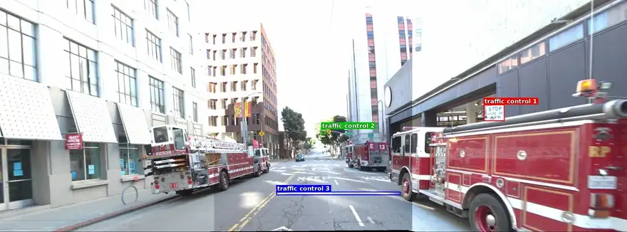
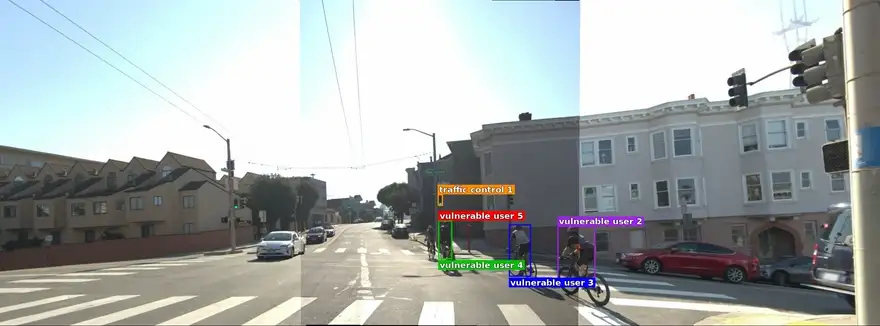
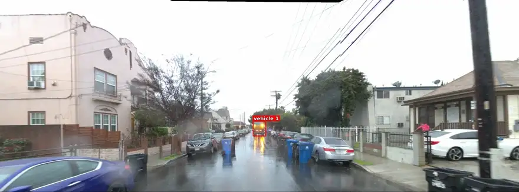
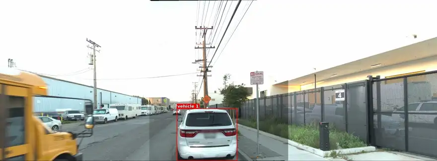
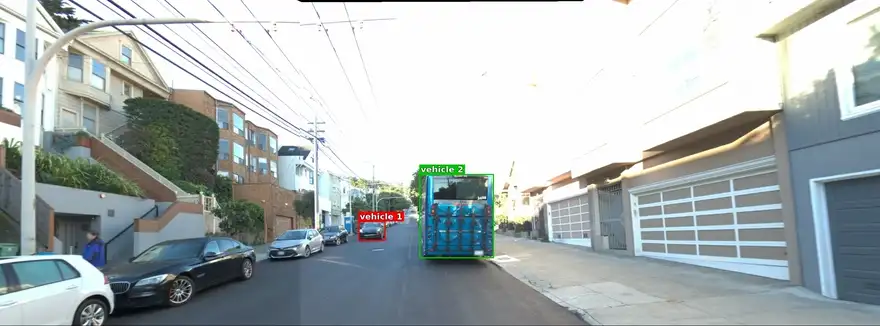

<div align="center">

<p><b>AnchorReasoning</b> — visual grounding and causal reasoning for end-to-end autonomous driving.<br>
<sub>Waymo End-to-End Driving &nbsp;·&nbsp; point-anchored objects &nbsp;·&nbsp; a reasoning chain that ends in a 5 s trajectory</sub></p>
<p><a href="data_preparation/README.md"><b>Data preparation</b></a> &nbsp;·&nbsp; <a href="training/README.md"><b>Training</b></a> &nbsp;·&nbsp; <a href="evaluation/README.md"><b>Evaluation</b></a></p>
</div>

## What this is

A sample is one panorama stitched from the three forward cameras (`FRONT_LEFT | FRONT | FRONT_RIGHT`,
2916x1079), the ego vehicle's past 4 s of motion and a high-level intent. Its annotation names the salient
objects — each anchored by a point in the image and carrying its driving implication — plus a reasoning
rationale, a final plan, a motion description and the 5 s future trajectory. A vision-language backbone is
fine-tuned on it in two stages — **Stage-1** structured scene understanding, **Stage-2** the full reasoning
chain ending in a trajectory — then evaluated with the official Waymo rater-feedback score.

## Samples

Annotated scenes. Each preview is a five-second loop; click it for the full clip (about 20 s).

<p align="center"><a href="assets/samples/stop_line_red_light.mp4"></a><br>
<sub><b>Stop line, red light</b> — sunny urban mid-block; a sign, a red light and a stop line, ranked in that order → decelerate to a full stop at the stop line and wait.</sub></p>
<p align="center"><a href="assets/samples/cyclists_intersection.mp4"></a><br>
<sub><b>Cyclists at an intersection</b> — sunny urban residential junction; a green light ranked first, then four cyclists in the adjacent lane → keep lane and creep forward.</sub></p>
<p align="center"><a href="assets/samples/rainy_narrow_street.mp4"></a><br>
<sub><b>Narrow street in the rain</b> — suburban residential, visibility reduced; a truck stopping ahead and two roadside obstacles closing the corridor → keep lane and decelerate.</sub></p>
<p align="center"><a href="assets/samples/school_bus_overtake.mp4"></a><br>
<sub><b>Past a parked car, bus alongside</b> — cloudy suburban street; a car parked at the curb, a school bus moving in the adjacent lane → wait for the bus to clear, then nudge left and creep past.</sub></p>
<p align="center"><a href="assets/samples/pull_over_curbside.mp4"></a><br>
<sub><b>Pulling over to the curb</b> — sunny urban residential; an oncoming car and a bus parked at the roadside → decelerate and pull over to the right curb to stop.</sub></p>
<p align="center"><a href="assets/samples/animal_in_lane.mp4"></a><br>
<sub><b>Animal in the ego lane</b> — cloudy urban residential; a single object decides the frame → decelerate and keep lane.</sub></p>

## Repository

```
Waymo E2E tfrecord shards
  |  decode_waymo_e2e -> a folder per frame;  extract_rfs_frames -> the rated val frames
  v
frame folder   decoder:     panorama_geo.png  2916x1079 stitched forward view
                            frame.json        intent, past 4 s, future 5 s, rater prefs
               annotation:  panorama_geo.json context, objects (bbox, attributes,
                                              impact_rank, driving_implication),
                                              reason, final_plan
                            panorama_geo_sam2_coco.json  masks; an object's <point>
                                              anchor is sampled from its mask
  |  annotation_hygiene -> make_dev_split -> build_index -> build_caches -> plan_repair
  v
index_train.json + row-aligned caches + dev split
  |  train_stage.py --config <backbone>_s1.yaml  Stage-1: context -> events -> <obj> blocks
  |  train_stage.py --config <backbone>_s2.yaml  Stage-2, from the S1 best checkpoint: also
  |    implication -> reason -> final_plan -> motion (derived from the future states) ->
  |    traj, 5 waypoints at t = 1..5 s
  v
checkpoint
  |  eval_val456 / eval_dev: greedy decode, chain parsed, the 5 waypoints PCHIP-upsampled
  v                          to the official 20-point / 5 s grid
rater-feedback score, understanding + chain metrics, causal-intervention deltas
```

| Folder | What it holds |
| --- | --- |
| [`data_preparation/`](data_preparation/README.md) | Shards to frame folders, rated-validation extraction, annotation hygiene, the dev split, the training index, the row-aligned caches and the plan-repair overlay. |
| [`training/`](training/README.md) | The two-stage SFT: one entry point, one YAML per (backbone, stage), eight backbone adapters, SLURM launchers. |
| [`evaluation/`](evaluation/README.md) | Dev-set passes, rated-validation runs with the official score, causal interventions, CPU re-scoring, released-model baselines, per-frame renders. |

`training/core/` and `training/adapters/` are the shared library — paths, prompts, labels, the trajectory
codec, metrics — that the other two folders import, so **the repository root must be on `PYTHONPATH`**.

## Setup

Linux, Python 3.11 or newer (the released runs used CPython 3.12; `scipy>=1.17` sets the floor). Training and
generation need an NVIDIA GPU; decoding, index building, scoring and re-judging run on CPU — that subset is
`requirements-cpu.txt`, the GPU set `requirements.txt`, `requirements-viz.txt` the render extras.

| Needed for | Packages |
| --- | --- |
| Everything | `numpy>=2.2`, `scipy>=1.17` |
| Decoding, panoramas | `opencv-python-headless>=4.13`, `pillow>=12.0`, `protobuf>=6.33` (runtime for the Waymo E2E message classes) |
| Training, generation | `torch==2.8.0`, `torchvision==0.23.0`, `transformers>=4.57,<5`, `safetensors>=0.7`, `accelerate>=1.12`, `deepspeed==0.18.2`, `pyyaml>=6.0`, optionally `flash-attn==2.8.3` |
| LLM judges (`--judge`) | `openai>=2.0` |
| Figures, videos, renders | `matplotlib>=3.10` |
| Commented out, install by hand | `wandb` — the configs default to `trainer.report_to: wandb`, so install it or pass `wandb.enabled=false`; `omegaconf` (a config arriving as a `DictConfig`), `PyQt5` (interactive viewer), `pycocotools` |
| Not on PyPI | the Waymo E2E proto descriptor set (decoder, step 5) and `rater_feedback_utils.py` (official score, step 4) |

```bash
python3.12 -m venv .venv && . .venv/bin/activate      # or: uv venv --python 3.12 .venv
python -m pip install -U pip setuptools wheel

# 1. torch FIRST and alone, from the index matching your driver: it is a transitive dependency of
#    accelerate and deepspeed, so `-r requirements.txt` first would resolve some other build. On a
#    CPU-only host swap cu128 for cpu -- the plain PyPI linux-x86_64 wheel IS the CUDA build.
pip install --index-url https://download.pytorch.org/whl/cu128 torch==2.8.0 torchvision==0.23.0

# 2. everything else -- this also brings the ninja, packaging and psutil that step 3 needs
pip install -r requirements.txt        # GPU: training, generation, evaluation
# pip install -r requirements-cpu.txt  # CPU-only: decoding, index/caches, official scoring
# pip install -r requirements-viz.txt  # optional: figures, videos, per-frame renders

# 3. flash-attn: GPU only, after step 2, optional (model.attn=sdpa / --attn sdpa runs without it,
#    and the adapters fall back to sdpa with no CUDA device). The archs are a ';'-list of compute
#    capabilities (80;90;100;120) -- building only yours is far faster. Needs nvcc or CUDA_HOME.
MAX_JOBS=4 FLASH_ATTN_CUDA_ARCHS=90 pip install flash-attn==2.8.3 --no-build-isolation

# 4. the official rater-feedback scorer: one numpy-only file, copied in unchanged
mkdir -p third_party/waymo_metrics
curl -sfL -o third_party/waymo_metrics/rater_feedback_utils.py \
  https://raw.githubusercontent.com/waymo-research/waymo-open-dataset/master/src/waymo_open_dataset/metrics/python/rater_feedback_utils.py

# 5. Waymo E2E protos for the decoder -- one command, writes third_party/wod_e2e.desc
bash data_preparation/make_wod_desc.sh

# 6. paths, then the check that the environment holds together
export ANCHOR_ROOT="$PWD" ANCHOR_WEIGHTS="$PWD/weights/base" ANCHOR_DATA="$PWD/data"
export PYTHONPATH="$PWD${PYTHONPATH:+:$PYTHONPATH}"     # the repository root must be importable
python -c "import torch, transformers; print(torch.__version__, torch.cuda.is_available())"
python -c "from training.adapters.registry import REGISTRY; print(sorted(REGISTRY))"
```

`rejudge.py` and `baselines/rescore.py` run GPU-free but import `torch` and `transformers` at module import
time, so a CPU-only host needs both on top of `requirements-cpu.txt` (`pip install transformers==4.57.1`
plus the step-1 CPU wheel), run with `CUDA_VISIBLE_DEVICES=""`.

Step 5 is only for `data_preparation/decode_waymo_e2e.py`, and only because there is no usable
`waymo-open-dataset` distribution on PyPI: `data_preparation/wod_proto.py` builds the one message the decoder
needs out of the descriptor set the script writes, which takes nothing beyond the `protobuf` runtime. Skip
the step if you decode no shards, or if the `waymo_open_dataset` package is already importable — `wod_proto.py`
uses it automatically when it is. The generator needs network access and installs `protoc` into a throwaway
prefix, so the active environment is never modified; set `$WOD_DESC`, or pass a path as the first argument,
to write and read the descriptor set somewhere else.

<details>
<summary><b>Base backbone weights, and the full environment-variable table</b></summary>

Weights go under `$ANCHOR_WEIGHTS` in one of two layouts — the "Base weights" column of
[`training/README.md`](training/README.md) says which one each adapter expects. `hf` comes with
`huggingface_hub`, a `transformers` dependency; gated repositories need `hf auth login` first.

```bash
# plain model directory, named exactly as the adapter expects
hf download Qwen/Qwen2.5-VL-7B-Instruct --local-dir "$ANCHOR_WEIGHTS/Qwen2.5-VL-7B-Instruct"
# hub-cache layout: models--<org>--<repo>/snapshots/<hash>, exactly one snapshot per repository
HF_HUB_CACHE="$ANCHOR_WEIGHTS" hf download nvidia/Cosmos-Reason2-8B
```

Every path is resolved through `training/core/paths.py` and defaults to a location under `$ANCHOR_ROOT`, so
only the step-6 exports are needed unless the data or the outputs live outside the checkout. The evaluation
SLURM launchers additionally read `ANCHOR_PYTHON` for the interpreter, the training ones `PYTHON_BIN`.

| Variable | Default | Holds |
| --- | --- | --- |
| `ANCHOR_ROOT` | this checkout | repository root; base of every default below |
| `WAYMO_TRAIN_ROOT` | `datasets/waymo_e2e_processed` | decoded training frame folders |
| `WAYMO_VAL_ROOT` | `datasets/waymo_e2e_processed_val` | decoded validation frames; also holds `rater_feedback_frames/` and the cluster JSON |
| `ANCHOR_DATA` | `data` | index, caches, dev split, plan-repair overlay |
| `ANCHOR_WEIGHTS` | `weights/base` | base backbone checkpoints (`ANCHOR_BASE_PATH` overrides it with a node-local copy) |
| `ANCHOR_RUNS`, `ANCHOR_EVAL`, `ANCHOR_CACHE`, `ANCHOR_LOGS` | `runs`, `eval_results`, `cache`, `logs` | training and evaluation outputs, scratch cache, job logs |
| `WAYMO_METRICS_SRC` | `third_party/waymo_metrics` | directory holding `rater_feedback_utils.py` |
| `WAYMO_CALIB_JSON` | `$ANCHOR_DATA/calib_fixed.json` | camera calibration used by the renderer |
| `ANCHOR_RATED_INDEX` | `waymo_e2e_index/val_rated_only.jsonl` | locates a rated frame outside the flattened folder |
| `OPENAI_API_KEY_FILE` | `api_key.txt` | LLM-judge key file; `OPENAI_API_KEY` and `JUDGE_MODEL` are read too |

</details>

## Quick start

From the repository root, with the step-6 environment exported. Every script takes `--help`.

**1. Data preparation** — schema and the visualisation scripts: [`data_preparation/README.md`](data_preparation/README.md)

```bash
# tfrecord shards -> one folder per frame (panorama_geo.png + frame.json)
python -m data_preparation.decode_waymo_e2e --split train --src /path/to/wod_e2e/train
python -m data_preparation.decode_waymo_e2e --split val   --src /path/to/wod_e2e/val
python -m data_preparation.extract_rfs_frames    # rated val frames -> rater_feedback_frames/
# annotation hygiene (normalised context enums + intent_corrected): count first, then apply
python -m data_preparation.annotation_hygiene --dry-run
python -m data_preparation.annotation_hygiene --apply --changed-only --workers 16
# dev split, then the index with those scenes excluded, the caches and the plan overlay
python -m data_preparation.make_dev_split --seed 0 --workers 16
python -m data_preparation.build_index --exclude-scenes "$ANCHOR_DATA/dev_scenes.json" --workers 32
python -m data_preparation.build_caches --workers 32   # --index defaults to the index above
python -m data_preparation.plan_repair  --workers 32
```

Only frame folders holding both `frame.json` and `panorama_geo.json` enter the index. For a smoke run,
`decode_waymo_e2e` takes `--shards / --max-scenes / --max-frames`, and every script below it except
`extract_rfs_frames` takes `--limit`.

**2. Training** — the 16 configs (8 backbones x 2 stages) and the launchers: [`training/README.md`](training/README.md)

```bash
# resolve the config and build the dataset without loading a model, then a 3-step smoke run
python training/train_stage.py --config training/configs/qwen25_7b_s1.yaml --print-config
python training/train_stage.py --config training/configs/qwen25_7b_s1.yaml --smoke
# Stage-1, then Stage-2 (which starts from the Stage-1 best checkpoint named by init_from)
torchrun --standalone --nproc_per_node=4 training/train_stage.py \
    --config training/configs/qwen25_7b_s1.yaml trainer.gradient_accumulation_steps=16 wandb.enabled=false
torchrun --standalone --nproc_per_node=4 training/train_stage.py \
    --config training/configs/qwen25_7b_s2.yaml trainer.gradient_accumulation_steps=16 wandb.enabled=false
```

Any trailing `key.sub=value` overrides the YAML. The configs ship the 2-GPU accumulation
(`1 x 2 GPUs x 32 = 64 frames per optimizer step`), so set it to `64 / GPUs` when the GPU count changes.
`wandb.enabled=false` also downgrades `trainer.report_to` (otherwise `wandb`) to `none`; `--smoke` does too.

**3. Evaluation** — baselines, GPU-free re-judging, renders: [`evaluation/README.md`](evaluation/README.md)

```bash
# the main run: Stage-2 pass over the rated validation frames + the official rater-feedback score
python -m evaluation.eval_val456 --ckpt runs/qwen25_7b_s2/best/best_stage_s2 --run qwen25_7b_s2 --judge
# the internal dev split, either stage (--frames defaults to $ANCHOR_DATA/dev_eval_frames.json)
python -m evaluation.eval_dev --ckpt runs/qwen25_7b_s2/best/best_stage_s2 --stage s2 \
    --out eval_results/qwen25_7b_s2/dev_s2_metrics.json
# the causal-intervention experiments, re-using the chains the run above wrote
python -m evaluation.ci_eval --ckpt runs/qwen25_7b_s2/best/best_stage_s2 --run qwen25_7b_s2 \
    --base-dir eval_results/qwen25_7b_s2
# score any prediction file on CPU (--reference gt|cv|static|ceiling scores a reference row instead)
python -m evaluation.run_rfs --preds eval_results/qwen25_7b_s2/rfs_preds.json \
    --out-dir eval_results/qwen25_7b_s2/rescored
```
